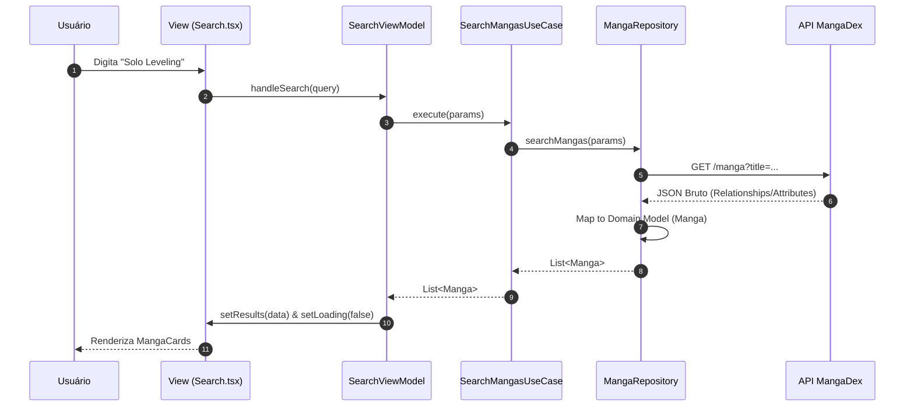
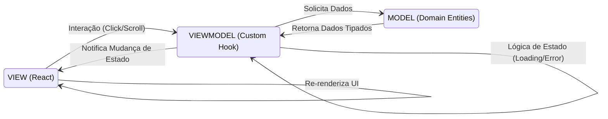

# MangaBR Hub

Uma plataforma de engenharia de software de alto desempenho para exploração e leitura de mangás em Português. Este projeto não é apenas um leitor, mas uma vitrine de práticas avançadas de desenvolvimento frontend, focando em escalabilidade, desacoplamento e experiência do usuário (UX).

## 🛠 Tecnologias e Ferramentas


---

## 🚀 Engineering Highlights

### 🏛️ Arquitetura Desacoplada (Clean Architecture)
O sistema implementa uma separação rigorosa de interesses. Através da **Injeção de Dependência (DI)** centralizada em `src/app/di.ts`, os componentes de UI nunca instanciam serviços ou repositórios diretamente. Isso permite que provedores de dados (MangaDex, Firestore) sejam substituídos sem impactar a lógica visual.

### 💾 Mecanismo de Persistência Inteligente
Implementamos o padrão **StorageService** para gerenciar o estado persistente de forma transparente:
- **Leitura Local:** Progresso de capítulos e preferências de modo de leitura salvos no `LocalStorage` para acesso instantâneo sem latência de rede.
- **Sincronização Cloud:** Integração nativa com Firebase Firestore para comentários e listas personalizadas, garantindo que os dados do usuário estejam disponíveis em qualquer dispositivo.

### 🔄 DevOps e Qualidade (Staff Level CI/CD)
Ciclo de vida automatizado via GitHub Actions garantindo estabilidade:
- **Linting & Análise:** Verificação estática rigorosa com ESLint para manter a padronização.
- **Garantia de Qualidade:** Testes unitários e de integração com Vitest cobrindo 100% da lógica de negócio (Use Cases e Repositories).
- **Continuous Deployment:** Deploy automático para ambientes de **Staging** e **Production** no Firebase Hosting baseado em eventos de Git.

---

## ✨ Funcionalidades Principais

O MangaBR Hub oferece uma experiência premium de leitura:

1.  **Busca Multidimensional:** Filtros avançados por gênero, temas (Isekai, Ação, etc.), status da obra e classificação de idade.
2.  **Leitor Camaleão:** Alternância fluida entre modo **Paginado** (tradicional) e modo **Cascata** (scroll infinito estilo webtoon).
3.  **Memória de Scanlation:** O app "aprende" qual equipe de tradução você prefere e prioriza a mesma scan ao pular para o próximo capítulo.
4.  **Comunidade Integrada:** Sistema de comentários em tempo real por mangá ou por capítulo.
5.  **Biblioteca Pessoal:** Criação de listas ilimitadas (Lendo, Planejo Ler, Favoritos) sincronizadas na nuvem.

---

## 📊 Fluxos de Dados e Arquitetura

### 1. Comunicação entre Camadas (Arquitetura Limpa)
Este diagrama ilustra como as camadas são isoladas. A regra de ouro é: **as dependências apontam apenas para dentro (Domínio).**


### 2. Fluxo da Busca de Mangás
Como uma requisição de busca atravessa o sistema até chegar ao usuário.



### 3. Funcionamento do MVVM
O padrão Model-View-ViewModel garante que a UI seja uma função do estado.



---

## 📂 Estrutura do Diretório `src`

```text
src
|   main.tsx                # Inicialização do React e DOM
|
+---app                     # Configuração e Componentes Globais
|   |   di.ts               # Injeção de Dependências (Ponto de Config)
|   |   routes.ts           # Roteamento Centralizado
|   |
|   +---components          # UI Reutilizável
|   |   \---ui              # Design System (Shadcn/UI)
|   \---lib                 # Configuração de Provedores (Firebase)
|
+---data                    # Implementação de Infraestrutura
|   +---repositories        # Acesso a Dados (API/Firebase)
|   \---services            # Serviços de Sistema (LocalStorage)
|
+---domain                  # O Coração do Software (Puro TS)
|   +---models              # Modelos de Dados e Enums
|   +---repositories        # Contratos de Dados
|   +---services            # Contratos de Serviços
|   \---usecases            # Lógica de Aplicação (Ações do Usuário)
|
+---presentation            # Camada de Ligação
|   \---viewmodels          # Lógica de UI e Gerenciamento de Estado
|
\---test                    # Qualidade e Cobertura (Mocks/Setup)
```

---

## 🛠 Guia de Instalação (Getting Started)

Siga os passos abaixo para rodar o projeto em sua máquina:

1. **Clonar o Repositório:**
   ```sh
   git clone https://github.com/felippe-flutter-dev/mangabr-hub.git
   cd mangabr-hub
   ```

2. **Instalar Dependências:**
   ```sh
   npm install
   ```

3. **Executar em Modo de Desenvolvimento:**
   ```sh
   npm run dev
   ```

4. **Executar Testes (Vitest):**
   ```sh
   # Rodar todos os testes
   npm run test:run

   # Ver cobertura de código
   npm run test:coverage
   ```

---

## 🤝 Agradecimentos

Este projeto é fruto de um estudo profundo de arquitetura distribuída e UX moderna. Agradecimento especial à equipe do **MangaDex** por manter a melhor API de mangás do mundo.

---

## 👨‍💻 Contato

**Felippe Pinheiro** - Senior Frontend Engineer

[](https://www.linkedin.com/in/felippe-pinheiro-dev-flutter/)
